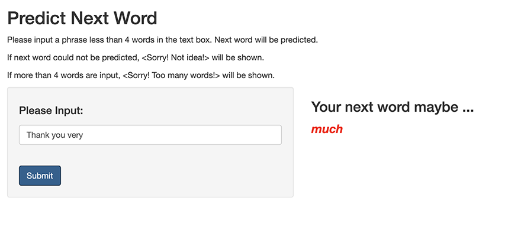

```{r setup, include=FALSE}
knitr::opts_chunk$set(echo = FALSE)
```

## Overview

This Shiny App allows user input a phrase and outputs the prediction of the next word according to the prediction model built in previous weeks.

* **ui.R**
    + A text box is used to captured a phrase less than 4 words.
    + If next word could not be predicted, **Sorry! No idea!** will be prompted.
    + If more than 4 words are input, **Sorry! Too many words!** will be prompted.
    + A *submit Button* is used to send the input phrase to **server.R**.

## Overview, continued

* **server.R**
    + The input phrase captured in *ui.R* will be sent to a ngram function **guess_next_word**. 
    + The next word will be predicted and returned **ui.R**

* **ngrams.R**
   + 4 data files are generated from a Prediction Model built previously for bigram, trigram, quadgram and quintgram.
   + The function **guess_next_word** will find the next word from 4 data files according to the number of words in the input phrase.
   + The word identified will be sent back to **ui.R** via **server.R**
  
* Please refer to **ui.R**, **server.R** and **ngrams.R** for details.

## Output from ShinyApp




## Shiny App and Source Codes URLs

- [Shiny Application at shinyapps.io](https://hwongcy.shinyapps.io/Guess_Next_Word/)

- [Source Codes at GitHub](https://github.com/hwongcy/DSCapstone_Final_Project)
